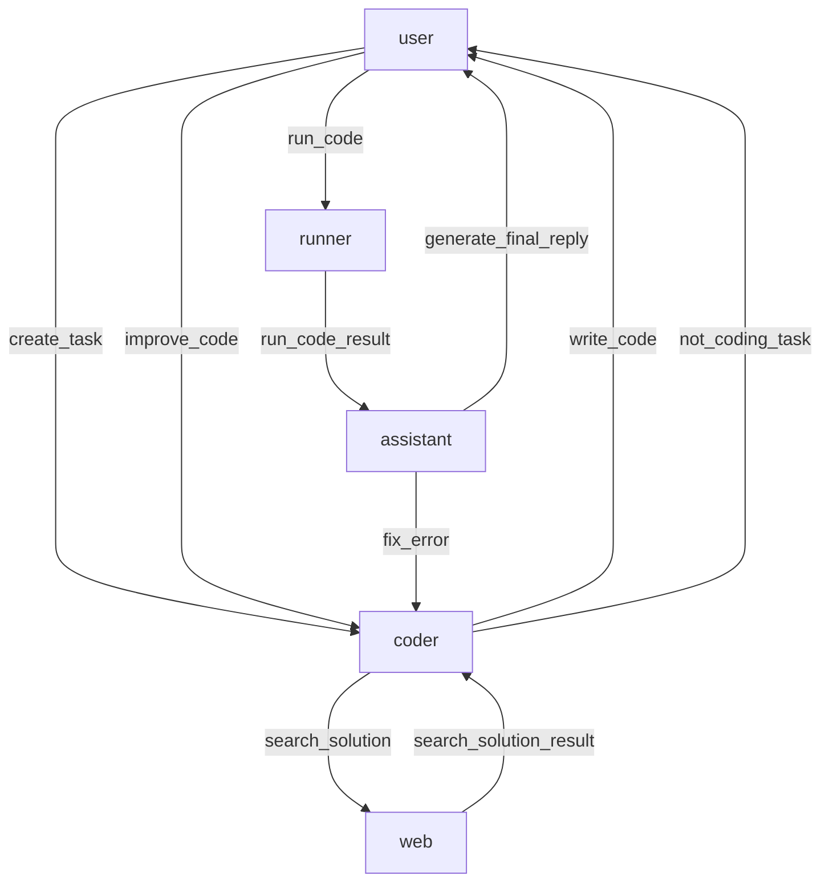

## Human-in-the-loop Code Interprete workflow



## Get start
### Pre-requisite
- dotnet 8.0
- python with jupyter and ipykernel setup
    - to install jupyter, run `pip install jupyter`
    - to install ipykernel, run `pip install ipykernel`
    - to setup ipykernel, run `python -m ipykernel install --user --name=python3`
- env:OPENAI_API_KEY
- env:BING_API_KEY

### Run the demo
cd to the current directory and

```bash
dotnet run
```
