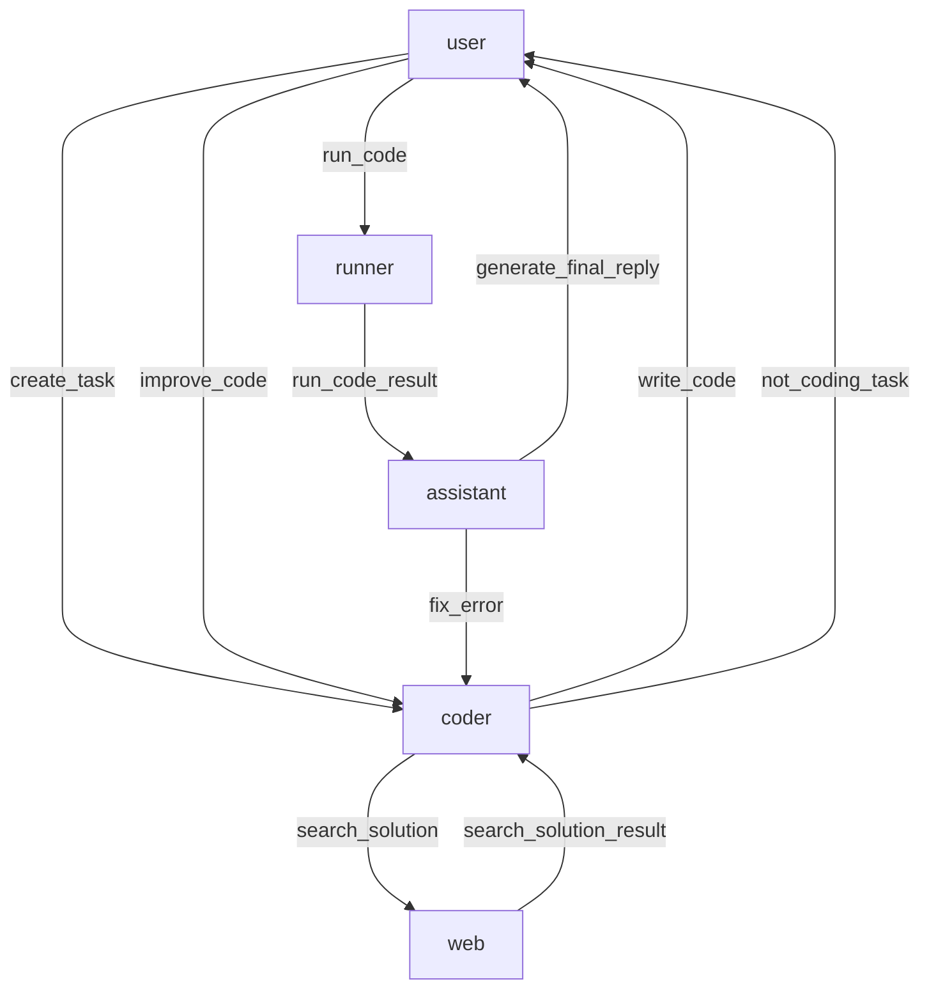

Human-in-the-loop Code Interprete workflow

```mermaid
flowchart TD
user ---> | create_task | coder
user ---> | improve_code | coder
coder ---> | write_code | user
coder ---> | not_coding_task | user
user ---> | run_code | runner
runner ---> | run_code_result | assistant
assistant ---> | generate_final_reply | user
assistant ---> | fix_error | coder
coder ---> | search_solution | web
web ---> | search_solution_result | coder
```
