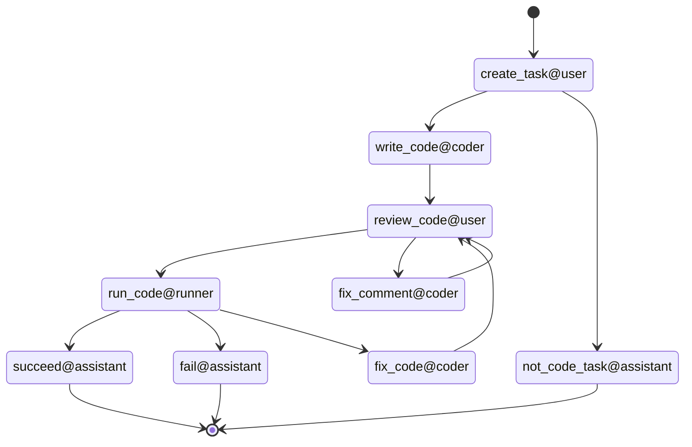

## Human-in-the-loop Code Interpreter workflow

[demo](asset/screenshot.png)

## Get start
### Pre-requisite
- dotnet 8.0
- python with jupyter and ipykernel setup
    - to install jupyter, run `pip install jupyter`
    - to install ipykernel, run `pip install ipykernel`
    - to setup ipykernel, run `python -m ipykernel install --user --name=python3`
    - to confirm the setup, run `jupyter kernelspec list` and you should see `python3` in the list
- env:OPENAI_API_KEY
- env:BING_API_KEY

### Run the workflow

The recommended way to run the workflow is to use the [Agent Chatroom](https://github.com/LittleLittleCloud/Agent-ChatRoom), which provides a chatroom UI to interact with the agents in the workflow.

To run the chatroom, cd to the cloned repo and run the following command:

```bash
dotnet run
```

A chatroom UI will be started at http://localhost:50001, and you can interact with the agents in `dotnet-interactive-chatroom` channel.

## Workflow State Transition Diagram

