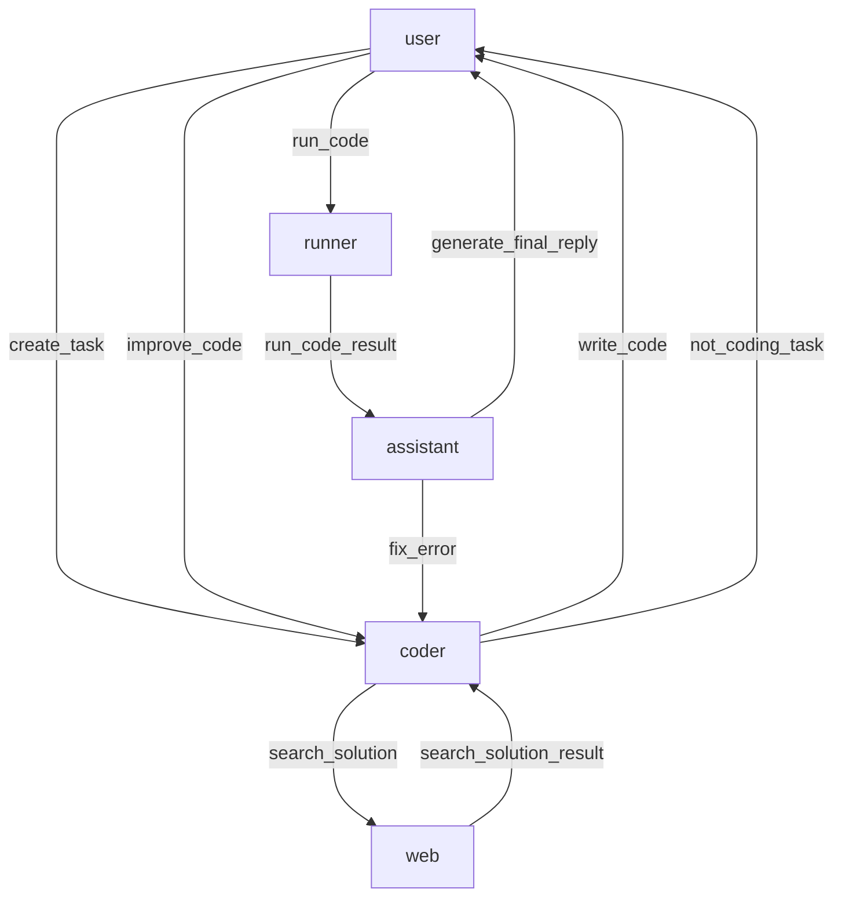

## Human-in-the-loop Code Interpreter workflow



## Get start
### Pre-requisite
- dotnet 8.0
- python with jupyter and ipykernel setup
    - to install jupyter, run `pip install jupyter`
    - to install ipykernel, run `pip install ipykernel`
    - to setup ipykernel, run `python -m ipykernel install --user --name=python3`
    - to confirm the setup, run `jupyter kernelspec list` and you should see `python3` in the list
- env:OPENAI_API_KEY
- env:BING_API_KEY

### Run the demo
cd to the current directory and

```bash
dotnet run
```

## Example
### task: Download AAPL/META/MSFT stock price from Yahoo Finance and save it to a CSV file. Then open it in VSCode.
```bash
from: assistant
The code execution was successful. The stock prices for AAPL, META, and MSFT have been saved to 'stock_prices.csv', and the file has been opened in VSCode.

Chat completed successfully
Task:
Download AAPL/META/MSFT stock price from Yahoo Finance and save it to a CSV file. Then open it in VSCode.

Code:
To accomplish the task of downloading stock prices for AAPL, META, and MSFT from Yahoo Finance, saving them to a CSV file, and then opening that file in VSCode, we can use Python with the `yfinance` library. First, we'll install the necessary package, fetch the stock prices, save them to a CSV file, and then use a command to open that file in VSCode.

Here's the complete code:

```python
%pip install yfinance
```

```python
import yfinance as yf
import pandas as pd

# Define the stock symbols
stocks = ['AAPL', 'META', 'MSFT']

# Download stock data
data = yf.download(stocks, start='2020-01-01', end='2023-10-01')

# Save data to CSV
data.to_csv('stock_prices.csv')

# Print confirmation
print("Stock prices saved to 'stock_prices.csv'.")

# Open the CSV file in VSCode
import os
os.system("code stock_prices.csv")
```

This script will:
1. Install the `yfinance` package.
2. Download historical stock prices for AAPL, META, and MSFT from January 1, 2020, to October 1, 2023.
3. Save the data to a file named `stock_prices.csv`.
4. Open the CSV file in Visual Studio Code.

Make sure to run this code in an environment where you have access to VSCode and the necessary permissions to install packages and execute system commands.

Execution Result:
[Python Code Block]
```python
%pip install yfinance
```

[Execute Result]
Requirement already satisfied: yfinance in c:\users\xiaoyuz\appdata\local\anaconda3\lib\site-packages (0.2.41)Note: you may need to restart the kernel to use updated packages.

Requirement already satisfied: pandas>=1.3.0 in c:\users\xiaoyuz\appdata\local\anaconda3\lib\site-packages (from yfinance) (2.2.2)
Requirement already satisfied: numpy>=1.16.5 in c:\users\xiaoyuz\appdata\local\anaconda3\lib\site-packages (from yfinance) (1.26.4)
Requirement already satisfied: requests>=2.31 in c:\users\xiaoyuz\appdata\local\anaconda3\lib\site-packages (from yfinance) (2.32.2)
Requirement already satisfied: multitasking>=0.0.7 in c:\users\xiaoyuz\appdata\local\anaconda3\lib\site-packages (from yfinance) (0.0.11)
Requirement already satisfied: lxml>=4.9.1 in c:\users\xiaoyuz\appdata\local\anaconda3\lib\site-packages (from yfinance) (5.2.1)
Requirement already satisfied: platformdirs>=2.0.0 in c:\users\xiaoyuz\appdata\local\anaconda3\lib\site-packages (from yfinance) (3.10.0)
Requirement already satisfied: pytz>=2022.5 in c:\users\xiaoyuz\appdata\local\anaconda3\lib\site-packages (from yfinance) (2024.1)
Requirement already satisfied: frozendict>=2.3.4 in c:\users\xiaoyuz\appdata\local\anaconda3\lib\site-packages (from yfinance) (2.4.2)
Requirement already satisfied: peewee>=3.16.2 in c:\users\xiaoyuz\appdata\local\anaconda3\lib\site-packages (from yfinance) (3.17.6)
Requirement already satisfied: beautifulsoup4>=4.11.1 in c:\users\xiaoyuz\appdata\local\anaconda3\lib\site-packages (from yfinance) (4.12.3)
Requirement already satisfied: html5lib>=1.1 in c:\users\xiaoyuz\appdata\local\anaconda3\lib\site-packages (from yfinance) (1.1)
Requirement already satisfied: soupsieve>1.2 in c:\users\xiaoyuz\appdata\local\anaconda3\lib\site-packages (from beautifulsoup4>=4.11.1->yfinance) (2.5)
Requirement already satisfied: six>=1.9 in c:\users\xiaoyuz\appdata\local\anaconda3\lib\site-packages (from html5lib>=1.1->yfinance) (1.16.0)
Requirement already satisfied: webencodings in c:\users\xiaoyuz\appdata\local\anaconda3\lib\site-packages (from html5lib>=1.1->yfinance) (0.5.1)
Requirement already satisfied: python-dateutil>=2.8.2 in c:\users\xiaoyuz\appdata\local\anaconda3\lib\site-packages (from pandas>=1.3.0->yfinance) (2.9.0.post0)
Requirement already satisfied: tzdata>=2022.7 in c:\users\xiaoyuz\appdata\local\anaconda3\lib\site-packages (from pandas>=1.3.0->yfinance) (2023.3)
Requirement already satisfied: charset-normalizer<4,>=2 in c:\users\xiaoyuz\appdata\local\anaconda3\lib\site-packages (from requests>=2.31->yfinance) (2.0.4)
Requirement already satisfied: idna<4,>=2.5 in c:\users\xiaoyuz\appdata\local\anaconda3\lib\site-packages (from requests>=2.31->yfinance) (3.7)
Requirement already satisfied: urllib3<3,>=1.21.1 in c:\users\xiaoyuz\appdata\local\anaconda3\lib\site-packages (from requests>=2.31->yfinance) (2.2.2)
Requirement already satisfied: certifi>=2017.4.17 in c:\users\xiaoyuz\appdata\local\anaconda3\lib\site-packages (from requests>=2.31->yfinance) (2024.6.2)

[Python Code Block]
```python
import yfinance as yf
import pandas as pd

# Define the stock symbols
stocks = ['AAPL', 'META', 'MSFT']

# Download stock data
data = yf.download(stocks, start='2020-01-01', end='2023-10-01')

# Save data to CSV
data.to_csv('stock_prices.csv')

# Print confirmation
print("Stock prices saved to 'stock_prices.csv'.")

# Open the CSV file in VSCode
import os
os.system("code stock_prices.csv")
```

[Execute Result]
[                       0%%                      ]
[**********************67%%******                ]  2 of 3 completed
[*********************100%%**********************]  3 of 3 completed


Stock prices saved to 'stock_prices.csv'.

0


Final Answer:
The code execution was successful. The stock prices for AAPL, META, and MSFT have been saved to 'stock_prices.csv', and the file has been opened in VSCode.
```


